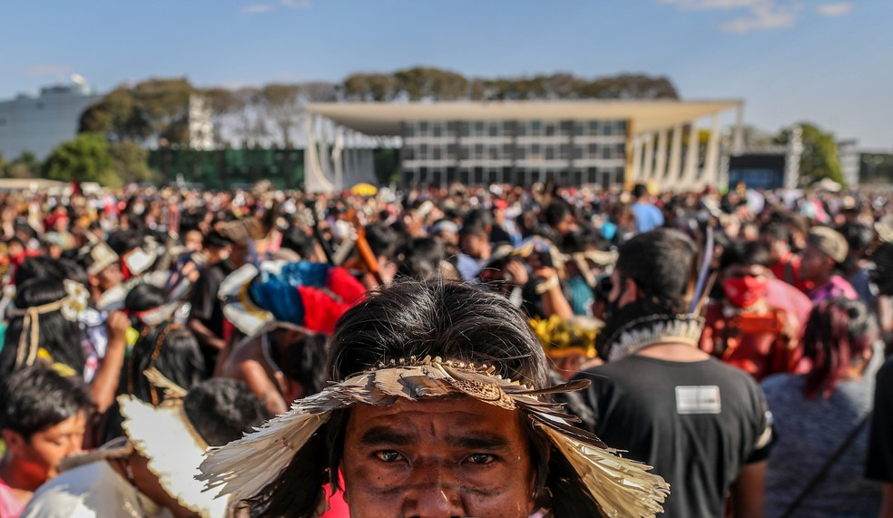
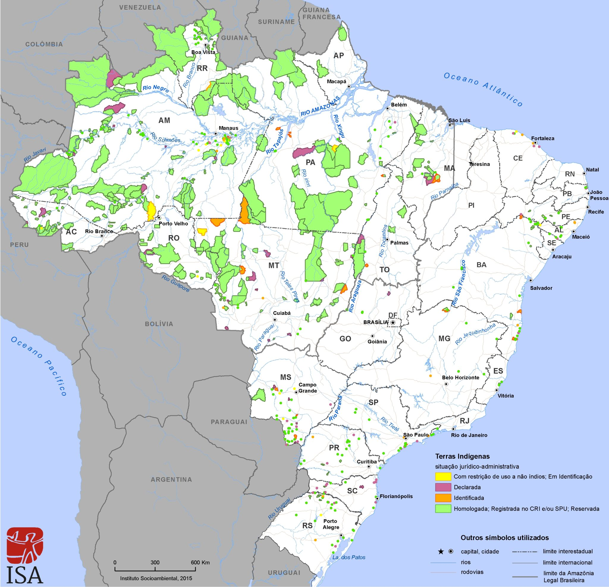

  <i>“A grande diferença que existe entre o pensamento dos índios e o pensamento dos brancos é que estes acham que o ambiente é recurso natural, como se fosse um almoxarifado em que se tira as coisas. Para o índio, é um lugar que tem de se pisar suavemente, porque está cheio de outras presenças.”
  </i>
  - Encontros (2015), Aílton Krenak.

  No dia 01/09/2021 foi retomado o julgamento da tese jurídica “Marco Temporal”, que deputados tentam transformar em lei (PL n° 490/2007). O marco temporal determina que devem ter direito às terras consideradas ancestrais somente os povos que as estivessem ocupando no dia da promulgação da Constituição Federal (05/10/1988), ou seja, desconsiderando os indígenas que foram expulsos de suas terras antes daquela data ou que não estavam lá fisicamente mas que circulavam por aquele terreno para a busca de elementos fundamentais para a sobrevivência física e manutenção dos costumes e cultura da aldeia.
  

   Esse é um dos ataques que as comunidades indígenas vêm sofrendo desde a tomada de seu território com a colonização europeia, e agora, o embate com ruralistas, pecuaristas e grandes empresas (que no geral precisam desmatar e modificar o ambiente para implementarem seus negócios) são o motivo da luta dos povos originários.
  

   Atualmente, o território indígena está demarcado em 487 terras homologadas e em outras 724 em diferentes fases do processo demarcatório (ocupando 13% do território brasileiro) distribuídas em diversas tribos com culturas, línguas e costumes diferentes.
  

<figure>
  
  <figcaption>
    [2] Indígenas de diversas regiões do país protestam na Praça dos Três Poderes contra o "marco temporal" para a demarcação de terras (foto: Gabriela Biló/Estadão Conteúdo).
  </figcaption>
</figure>
<ul>
  <li style="font-weight: 400;" aria-level="1">
    <strong>POVOS INDÍGENAS E MEIO AMBIENTE
    </strong>
  </li>
</ul>

   Povos indígenas, mesmo transformando o ambiente em seu benefício, não alteram os princípios de funcionamento e nem colocam em riscos as condições deste meio de se restituir, através da sabedoria passada de geração em geração que os possibilita o conhecimento da biodiversidade da região.
  

   A cultura e tradição indígena prevê uma atenção aos ciclos climáticos e as estações definidas, mostrando-os os melhores períodos para plantações e cultivos; É assim que eles alimentam uma produção sustentável.
  

   A mata tem um significado importante pras culturas indígenas, é uma presença sagrada e que espiritualmente guia o povo, fazendo parte intrinsecamente do ser humano e de todo o ser vivo, logo, se destruírem ela estão destruindo a si mesmos. Basta notar que onde tem indígenas têm natureza preservada.
  

<ul>
  <li>
    <strong>DEMARCAÇÃO
    </strong>
  </li>
</ul>

   É da competência da Fundação Nacional do Índio (FUNAI) articular a demarcação de terras indígenas, protegê-las e preservar seus bens; é dever dessa organização também fazer o monitoramento e fiscalização das terras.
  

   O processo de demarcação compreende, resumidamente, as seguintes etapas: Estudos de identificação e delimitação; Declaração dos limites; Demarcação física; Levantamento fundiário; Homologação da demarcação; Retirada de ocupantes não-índios; Registro das terras indígenas na Secretaria de Patrimônio da União, a cargo da Funai; Interdição de áreas para a proteção de povos indígenas isolados.
  

   As terras indígenas podem ser classificadas da seguinte forma:
  

  
    Terras Indígenas Tradicionalmente Ocupadas
    :
  
   São as terras indígenas de que trata o art. 231 da Constituição Federal de 1988.
  

  
    Reservas Indígenas
    :
  
   São terras doadas por terceiros, adquiridas ou desapropriadas pela União, que se destinam à posse permanente dos povos indígenas.
  

  
    Terras Dominiais
    :
  
   São as terras de propriedade das comunidades indígenas, havidas, por qualquer das formas de aquisição do domínio, nos termos da legislação civil.
  

<ul>
  <li>
    <strong>LEIS QUE AFETAM NEGATIVAMENTE OS POVOS INDÍGENAS
    </strong>
  </li>
</ul>
<ul style="list-style-type: circle;">
  <li style="font-weight: 400;" aria-level="1">
    PL 191: Regulariza a mineração em terras indígenas
    
  </li>
  <li style="font-weight: 400;" aria-level="1">
    PL 2633/2020 e 510/2021: Amplia áreas suscetíveis de regularização fundiária
    
  </li>
  <li style="font-weight: 400;" aria-level="1">
    PL 379/2004: Desmonte do licenciamento ambiental
    
  </li>
</ul>

   A causa indígena afeta todo o Brasil e inevitavelmente todo o mundo, já que podemos observar o conhecimento ancestral que esses povos têm da terra e o bom manejo dos recursos, o que seria crucial para mitigar os efeitos das mudanças climáticas, falta de recursos naturais e começar uma tentativa de restabelecer o equilíbrio dos biomas e ecossistemas.
  

<figure>
  
  <figcaption>
    Terras Indígenas no Brasil. Instituto Socioambiental, 2015.
  </figcaption>
</figure>

  <strong>REFERÊNCIAS
  </strong>

<ul style="list-style-type: circle;">
  <li>
    Imagem[1] 
    
    Indígenas na passeata até o STF: marco temporal pode ameaçar demarcação de terras (Foto: Kamikia Kisedje / Apib).
    
  </li>
  <li>
    <a href="https://g1.globo.com/politica/noticia/2021/08/27/o-que-e-o-marco-temporal-sobre-terras-indigenas-entenda-o-que-esta-em-jogo-no-julgamento-do-stf.ghtml">O que é o marco temporal sobre terras indígenas: entenda o que está em jogo no julgamento do STF - G1
    </a>
  </li>
  <li>
    <a href="https://www.youtube.com/watch?v=oheOMBhoLLE">Dalmo Dallari destrincha marco temporal (9min12s)
    </a>
  </li>
  <li>
    <a href="http://www.funai.gov.br/index.php/nossas-acoes/demarcacao-de-terras-indigenas">Terras Indígenas: O que é ? - Funai
    </a>
  </li>
  <li>
    <a href="http://www.funai.gov.br/index.php/2014-02-07-13-24-53">Entenda o processo de demarcação
    </a> 
  </li>
  <li>
    <a href="https://www.politize.com.br/demarcacao-de-terras-indigenas/">Terras indígenas: Como são demarcadas
    </a> 
  </li>
  <li>
    <a href="https://pib.socioambiental.org/pt/%C3%8Dndios_e_o_meio_ambiente">Índios e o meio ambiente - Instituto Socioambiental
    </a>
  </li>
  <li>
    <a href="https://ambitojuridico.com.br/cadernos/direito-ambiental/indigenas-sustentabilidade-e-meio-ambiente/amp/">Indígena, sustentabilidade e meio ambiente
    </a> 
  </li>
  <li>
    <a href="https://www.youtube.com/watch?v=k_QA2DRsl7Y">Povos indígenas e meio ambiente | O que podemos aprender? (8min12s)
    </a> 
  </li>
</ul>
