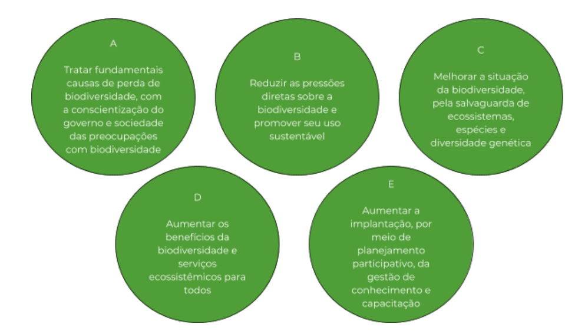
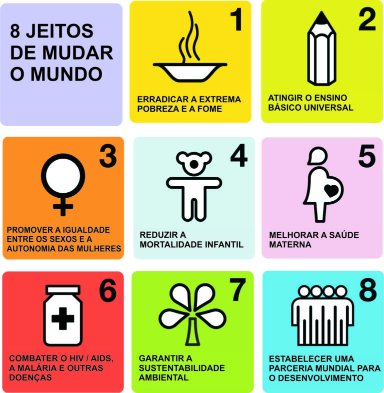

<b>Feliz dia da Biodiversidade!</b>

Muitos cientistas afirmam que estamos entrando na Sexta Grande Extinção. A partir de registros fósseis, sabemos que cinco grandes extinções já afetaram a Terra, como a dos dinossauros, por exemplo. Nos últimos séculos, a taxa de extinção tem sido até 100 vezes maior que a taxa natural e isso vem ocorrendo por causa das ações antropogênicas que afetam a biodiversidade, como desmatamento, agricultura e manipulação genética.

Mas afinal, o que é biodiversidade e o que a gente tem a ver com isso?

<iframe src="//giphy.com/embed/2vlC9FMLSmqGs" width="480" height="240" frameborder="0"></iframe>

???

É um conceito que surgiu em 1992 no Rio de Janeiro, na Conferência das Nações Unidas sobre Meio Ambiente e Desenvolvimento (CNUMAD). Nesse evento, se reconheceu a gravidade da crise ambiental mundial e como ela poderia afetar nossas vidas. Assim, foram firmados vários acordos, com destaque para a Convenção-Quadro das Nações Unidas sobre Mudanças Climáticas e a Convenção sobre Diversidade Biológica (CDB). Esta última definiu que diversidade biológica significa a “variabilidade de organismos vivos de todas as origens, compreendendo, dentre outros, os ecossistemas terrestres, marinhos e outros ecossistemas aquáticos, e os complexos ecológicos de que fazem parte, compreendendo, ainda, a diversidade dentro de espécies, entre espécies e ecossistemas”.

<iframe src="//giphy.com/embed/otnqsqqzmsw7K" width="480" height="270" frameborder="0"></iframe>

Uhul, vieram acordos para proteger a biodiversidade!!!

Em 2011, foi formulado o Plano Estratégico de Biodiversidade, para que sejam tomadas medidas com o intuito de assegurar que em 2020 - que já já tá aí, né? - os ecossistemas ainda sejam resilientes, isto é, consigam se recuperar dos danos ambientais e possam oferecer seus serviços. Ele é necessário para preservar a biodiversidade, que é o que sustenta o funcionamento dos ecossistemas que garantem a sobrevivência humana no planeta, contribuindo para a erradicação da pobreza, para o fornecimento de água e ar limpo, além de desenvolvimentos econômicos locais. Os países que se comprometem a seguir o plano são os que integram a Convenção sobre Diversidade Biológica (CDB): toda a União Européia, além de 193 países, incluindo o Brasil.

<iframe src="//giphy.com/embed/UdoS9OzIS2lgY" width="480" height="270" frameborder="0"></iframe>

Boa Brasil!

Para esse plano acontecer surgiram as Metas de Aichi na 10ª Conferência das Partes da CDB, realizada em Nagoia, no Japão. São 20 proposições para evitar a perda de biodiversidade no mundo que se subdividem em 5 grupos menores.

A preservação da biodiversidade também está presente nas Metas do Milênio, criadas pela ONU em 2000. 

Garantir a sustentabilidade ambiental é a Meta número 7 e inclui a redução na taxa de perda de biodiversidade. 

De acordo com a ONG World Wildlife Fund (WWF), o “Brasil é uma potência de biodiversidade e líder global nos esforços da CDB. Entretanto, a biodiversidade ainda não tem sido tratada com ênfase nas suas estratégias de desenvolvimento, e isso leva à perda gradual de um diferencial importante do País. É importante que o Brasil demonstre sua liderança na prática”, já que abriga a maior biodiversidade do planeta. Sua variedade de biomas reflete a enorme riqueza que se traduz em mais de 20% do número total de espécies da Terra.

<iframe src="//giphy.com/embed/pZdtSr6SARRdK" width="480" height="480" frameborder="0"></iframe>

Poxa Brasil :/

&nbsp;

Bibliografia

MMA. Ministério do Meio Ambiente. <b>FAQs - Biodiversidade – Metas de Aichi. </b>Disponível em: &lt;http://www.mma.gov.br/perguntasfrequentes?catid=33&amp;start=0&gt;. Acesso em: 01 maio 2018.

