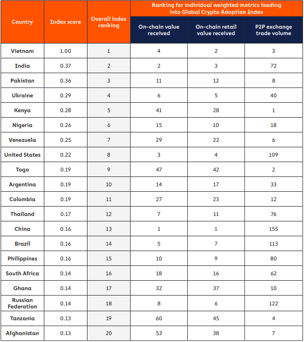

<!-- wp:paragraph -->

 Em 3 de Janeiro de 2009, com a criação do Bitcoin, o mundo via o surgimento de uma nova forma de dinheiro, as criptomoedas. Ao longo dos anos, elas se popularizaram, despertando diversas preocupações nas pessoas do mundo todo. Hoje, o impacto ambiental das moedas digitais é um dos principais problemas que permeiam esse mundo. 

 Antes de discutir os impactos dessa tecnologia, vamos analisar sua adoção em diferentes países. Segundo uma pesquisa realizada pela <em>Chainalysis</em> em outubro de 2021, a adoção mundial de criptomoedas aumentou 881% em relação a 2020. Nessa mesma pesquisa, o Brasil está ranqueado na 14ª posição dos países com maior adoção de moedas eletrônicas, sendo o país da América Latina com maior volume de transações (cerca de 91 bilhões de dólares) entre julho de 2020 e julho de 2021.

<figure><figcaption>Ranking dos países com maior adoção de criptomoedas em 2021 segundo as métricas do ‘Global Crypto Adoption Index’. (Fonte: https://go.chainalysis.com/rs/503-FAP-074/images/Geography-of-Cryptocurrency-2021.pdf)</figcaption></figure>

 Apesar de serem puramente digitais, as criptomoedas possuem um impacto perceptível no meio ambiente. Esse impacto está diretamente relacionado ao processo chamado <em>mineração</em>, responsável pela geração de novas moedas. O processo é realizado pelas mineradoras, máquinas de alto desempenho que realizam operações pesadas por longos períodos. Devido ao grau de complexidade dessas computações, o consumo de energia da rede de criptomoedas é extremamente elevado. Segundo a <em>Cambridge Bitcoin Energy Consumption Index (CBECI)</em>, instituto que monitora a rede de Bitcoin, o consumo energético dessa moeda é de, em média, 100 TWh por ano. Essa quantidade de energia é suficiente para abastecer países como Argentina e Suécia por um ano. 

 O problema, no entanto, está na origem dessa energia. De acordo com o <em>Cambridge Centre for Alternative Finance (CCAF)</em>, apenas 39% de toda energia utilizada nas redes de criptomoedas tem origem renovável. Por ser muito rentável e como forma de aumentar os lucros, o processo de mineração é prioritariamente abastecido por combustíveis mais baratos, como os combustíveis fósseis. A China, por exemplo, é responsável por cerca de 75% de toda mineração de Bitcoin no mundo, e entre os combustíveis mais utilizados pelas mineradoras chinesas encontra-se o carvão mineral, contribuindo para as mudanças climáticas.

<figure><figcaption>Emissão de gases de efeito estufa. (Fonte: https://unsplash.com/photos/TUJud0AWAPI)</figcaption></figure>

 Além do problema da energia, também deve-se levar em conta a rapidez com que as máquinas mineradoras são descartadas. Por estarem realizando computação pesada constantemente, esses computadores são trocados com certa frequência. De acordo com o pesquisador Alex de Vries, a substituição desses computadores por versões mais recentes é estimada em gerar 11.000 toneladas de lixo eletrônico por troca.

 Por causa de todos esses problemas, a preocupação com o impacto ambiental das moedas digitais vem aumentando. Em 2021, Elon Musk (CEO da Tesla) parou de aceitar Bitcoin como forma de pagamento em sua empresa. Toda essa preocupação pode indicar uma transição para um futuro mais sustentável no mundo das criptomoedas. No entanto, muitos pesquisadores acreditam que isso não seja possível. Além do problema da energia, deve-se considerar que apenas 20% do lixo eletrônico no mundo é reciclado, o que dificulta a sustentabilidade dessas moedas. Por outro lado, já existem hoje em dia redes de criptomoedas que independem da mineração, diminuindo tanto o consumo de energia, quanto o descarte de eletrônicos. Só podemos esperar que as moedas mais famosas alterem seu modo de funcionamento para, assim, vivermos em um planeta mais sustentável.

<h2 class="has-black-color has-text-color">Referências</h2>

<ul>
<li><a href="https://www.impactounesp.com.br/post/o-impacto-ambiental-invis%C3%ADvel-da-criptomoeda-bitcoin">https://www.impactounesp.com.br/post/o-impacto-ambiental-invis%C3%ADvel-da-criptomoeda-bitcoin</a></li>
<li><a href="https://www.uninter.com/noticias/o-imenso-impacto-ambiental-das-criptomoedas">https://www.uninter.com/noticias/o-imenso-impacto-ambiental-das-criptomoedas</a></li>
<li><a href="http://www.cest.poli.usp.br/wp-content/uploads/2018/08/V3N6-Impactos-Ambientais-da-Minera%C3%A7%C3%A3o-de-Criptomoedas.pdf">http://www.cest.poli.usp.br/wp-content/uploads/2018/08/V3N6-Impactos-Ambientais-da-Minera%C3%A7%C3%A3o-de-Criptomoedas.pdf</a></li>
<li><a href="https://www.jbs.cam.ac.uk/wp-content/uploads/2021/01/2021-ccaf-3rd-global-cryptoasset-benchmarking-study.pdf">https://www.jbs.cam.ac.uk/wp-content/uploads/2021/01/2021-ccaf-3rd-global-cryptoasset-benchmarking-study.pdf</a></li>
<li><a href="https://portaleconomia.com.br/impacto-das-criptomoedas-no-meio-ambiente-entenda/">https://portaleconomia.com.br/impacto-das-criptomoedas-no-meio-ambiente-entenda/</a></li>
<li><a href="https://cen.acs.org/environment/sustainability/Bitcoin-poses-major-electronic-waste/97/i11">https://cen.acs.org/environment/sustainability/Bitcoin-poses-major-electronic-waste/97/i11</a></li>
<li><a href="https://digiconomist.net/bitcoin-electronic-waste-monitor/">https://digiconomist.net/bitcoin-electronic-waste-monitor/</a></li>
<li><a href="https://www.cell.com/joule/fulltext/S2542-4351(19)30087-X?_returnURL=https%3A%2F%2Flinkinghub.elsevier.com%2Fretrieve%2Fpii%2FS254243511930087X%3Fshowall%3Dtrue">https://www.cell.com/joule/fulltext/S2542-4351(19)30087-X?_returnURL=https%3A%2F%2Flinkinghub.elsevier.com%2Fretrieve%2Fpii%2FS254243511930087X%3Fshowall%3Dtrue</a></li>
<li><a href="https://cbeci.org/">https://cbeci.org/</a></li>
<li><a href="https://go.chainalysis.com/rs/503-FAP-074/images/Geography-of-Cryptocurrency-2021.pdf">https://go.chainalysis.com/rs/503-FAP-074/images/Geography-of-Cryptocurrency-2021.pdf</a></li>
</ul>
