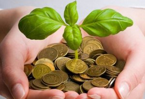

  

  A sustentabilidade econômica não possui uma definição específica, e sim um consenso entre vários âmbitos e autores que falam sobre esse tópico, a grosso modo tem a proposta de pensar a economia já existente de uma maneira diferente, uma vez que o meio ambiente sofreu inúmeras modificações ao longo dos anos.
  

  A visão neoclássica da economia é massivamente criticada, pois é analisada sob a perspectiva de apenas visar o lucro, sem a preocupação com as questões sociais e ambientais, fato motivado por essa época em que todos querem fazer parte, que incentiva o crescimento econômico acelerado, porém isso tem um grande custo.
  

  Como consequência da economia neoclássica, que consome de maneira desenfreada recursos naturais, principalmente fontes energéticas, há danos causados ao meio ambiente e sua biodiversidade que são irreversíveis, e não deveria ocorrer de tal maneira, já que sem o meio ambiente não há economia que resolva tais problemas.
  

  Uma leitura fundamental para entender mais sobre esse assunto é o livro "Muito Além da Economia Verde" escrito pelo economista Ricardo Abramovay, nele muitos conceitos e opções para uma sustentabilidade econômica são discorridos, entre eles a ecoficiência.
  

  A ecoficiência trata-se de produtos que podem ser produzidos em maiores quantidades e com uma qualidade superior, porém com o uso de menos recursos e resíduos do que pelo método tradicional, basicamente possui a premissa de produzir bens e serviços com preços competitivos no mercado, e de uma forma que não retira recursos naturais que são fundamentais.
  

  <a href="https://media.giphy.com/media/YqbUp2Lrhtoy8MtlGl/giphy.gif">
    
      <iframe src="//giphy.com/embed/YqbUp2Lrhtoy8MtlGl" width="480" height="480" frameborder="0">
      </iframe>
    
  </a>

  Tendo es
  
  te
  
  s pontos em mente, fica claro que a sustentabilidade econômica é um bom modo de 
  
  repensar a economia, com soluções até mais rentáveis e que visam a preservação do meio ambiente e seus recursos naturais, 
  
  deste modo garantindo a manutenção dos recursos naturais para as próximas gerações.
  

