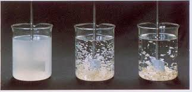
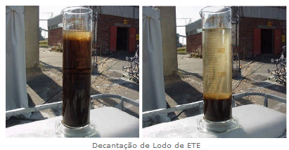

Você sabe o caminho que a água percorre até chegar na sua casa? Fácil abrir a torneira, mais fácil ainda é se distrair e exagerar no consumo... mas e o percurso que deixa essa água própria para você, quais são?

A água captada dos rios deve passar por diversas etapas de tratamento até ser considerada potável. Lembra que a gente comentou sobre os 
  <a href="http://seivajr.com/metais-pesados/">METAIS PESADOS 
  </a>? Esse é só um dos contaminantes que podem estar na água. Para poder ser considerada potável, a água deve seguir padrões estabelecidos por lei e estar livre de diversos microorganismos. Para um tratamento simples, o convencional. Para retirar poluentes emergentes ou aqueles mais difíceis, o avançado.

Vamos começar com o simples? Vem conhecer o grande caminho que a água percorre até chegar na sua torneira (e até mesmo no seu vaso sanitário!):

<h3 style="text-align: center;">
  <b>1. Coagulação e Floculação
  </b>
</h3>

 

  

Aqui as impurezas presentes na água são agrupadas pela ação do coagulante, formando os flocos, ou seja, as partículas maiores.

<h3 style="text-align: center;">
  <b>2. Decantação
  </b>
</h3>

    

Os flocos formados decantam, por gravidade se depositam no fundo do tanque.

<h3 style="text-align: center;">
  <b>3. Filtração
  </b>
</h3>

Essa água decantada é encaminhada até um filtro de várias camadas constituído de um meio poroso, como areia, instalado sobre um sistema de drenagem, capaz de reter e remover as impurezas ainda presentes.

<h3 style="text-align: center;">
  <b>4. Desinfecção
  </b>
</h3>

Depois de filtrada, um agente físico ou químico, como cloro ou luz ultravioleta, é utilizado com a finalidade de destruir os microrganismos patogênicos que possam transmitir doenças. 

<h3 style="text-align: center;">
  <b>5. Fluoretação
  </b>
</h3>

Nessa fase, a água recebe flúor. Para o abastecimento público, essa aplicação é importante pois reduz a incidência de cárie dentária na população. 

 

Que privilégio receber essa água não é mesmo!? Mas depois de utilizada ela alcança o outro espectro do consumo, o descarte pelo esgoto, que é tratado antes de ser despejado de volta na natureza. Mas você já imaginou que da natureza essa água pode voltar pro consumo doméstico?

Seria um ciclo quase que perfeito! E graças a meios de tratamentos, a água do esgoto pode ser tratada e utilizada diretamente para limpeza de ruas, jardinagem, tingimento de tecidos dentre outros exemplos. E ao final do tratamento, ela é despejado em córregos e rios, se juntando a água das chuvas que segue o tratamento acima, retornado a distribuição para a população. 

E como isso ocorre? 

Basicamente esse esgoto recebe três tratamentos especiais: Primeiro há reatores biológicos, uma espécie de ultrafiltração, que retém até 100% das partículas sólidas! Depois, por um processo chamado osmose por foto-oxidação, bactérias e vírus são eliminados. Esses processos oxidativos promovem uma degradação efetiva do poluente, aumentando sua biodegradabilidade. Por fim, há a desinfecção total em que uma radiação ultravioleta ataca o material genético dos microrganismos, impedindo sua multiplicação. 

  <iframe src="//giphy.com/embed/2q0QCQLagAk5q" width="480" height="271" frameborder="0">
  </iframe>

Incrível não é mesmo?! Juntando a tecnologia com o consumo consumo consciente, nossa água será tratada e retratada com educação e abundância. 

 

Fontes:

Imagens - http://www.snatural.com.br/decantador-tratamento-agua/ e http://www.naturaltec.com.br/decantadores-lamelas/

http://www.saopaulo.sp.gov.br/spnoticias/ultimas-noticias/entenda-como-a-agua-de-reuso-se-transforma-em-agua-potavel/

http://alfamec.com.br/produtos/tratamento-de-agua/eta-estacao-para-tratamento-de-agua-para-reuso/

https://www.caesb.df.gov.br/como-a-agua-e-tratada.html

http://site.sabesp.com.br/site/interna/Default.aspx?secaoId=569

