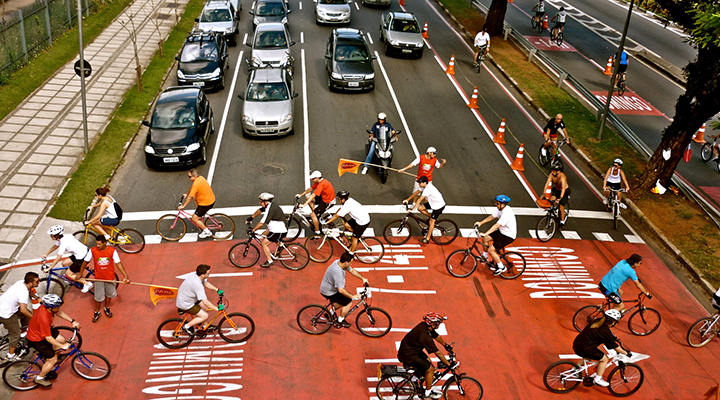

A mobilidade urbana está cada vez mais presente nas agendas acerca do futuro das cidades. Em decorrência do crescimento contínuo da população metropolitana e da consequente necessidade de transporte, os **problemas de trânsito, poluição e congestionamento** tornaram-se uma realidade que afeta a qualidade de vida das pessoas e o crescimento infraestrutural  das metrópoles.

Assim, entender o que é mobilidade urbana pode te ajudar a compreender melhor esse panorama. Envolve o movimento de pessoas e bens dentro do espaço urbano, que inclui uma variedade de meios de transporte como **ônibus, trens, bicicletas, automóveis**, entre outros. Além disso, a mobilidade urbana também inclui a infraestrutura necessária para realizar esses remanejamentos, como ruas, ciclovias, estações de trem, terminais de ônibus e outros eixos de trânsito.

No entanto, há uma série de desafios que a mobilidade urbana enfrenta que impedem uma realocação sustentável e efetiva. Um grande problema é o excesso de carros nas estradas, o que leva a congestionamentos e poluição. Para tentar fugir desse cenário, as pessoas buscam outras possibilidades, mas acabam se deparando com a falta de investimentos em transporte público de qualidade, como trens e metrôs, dificultando o deslocamento aos seus destinos. Ademais, outro ponto a se destacar é a infraestrutura inadequada para ciclistas, o que os coloca em risco de acidentes de trânsito, o que acarreta na diminuição no número de pessoas a optarem por esse tipo de transporte.

Como possíveis medidas para superar essas problemáticas, as cidades poderiam direcionar os investimentos em soluções de locomobilidade que priorizem o transporte público, a caminhada e a bicicleta em detrimento do uso de veículos particulares, visando uma integração entre os vários modais de transporte para garantir uma mobilidade mais efetiva e aberta para todos. Outra medida é a **promoção de políticas que estimulem o uso do transporte sustentável**, como campanhas de conscientização e investimentos em infraestrutura para bicicletas. A criação de mais faixas exclusivas para bicicletas e ônibus, a ampliação de ciclovias e a criação de zonas livres de carros são algumas das iniciativas que podem ser utilizadas para promover a mobilidade urbana sustentável.

Além disso, é fundamental ressaltar que a mobilidade urbana é um tema complicado que requer ação contínua e coordenada do poder público, do empresariado e da sociedade civil. É essencial que todas as partes envolvidas trabalhem juntas para desenvolver soluções inovadoras e eficazes que proporcionem uma mobilidade urbana mais acessível, eficaz e sustentável para todos

**_Referências_**

EDIFICAR JR. Mobilidade urbana: o que é e para onde vamos? 2022. Disponível em: <https://edificarjr.com/mobilidade-urbana-o-que-e-para-onde-vamos/>. Acesso em: abr. 2023.

DW BRASIL. Como a filosofia pode nos ajudar em tempos de crise?. YouTube, 2020. Disponível em: <https://www.youtube.com/watch?v=5rpnTUFQ0-A&ab_channel=DWBrasil>. Acesso em: abr. 2023.

GEOBRASIL. O que é Geoprocessamento? \[Vídeo]. YouTube, 2018. Disponível em: <https://www.youtube.com/watch?v=C-Ecbw6Xvjg&ab_channel=Geobrasil>. Acesso em: abr. 2023.

Feito por:

Vitor Malavasi
