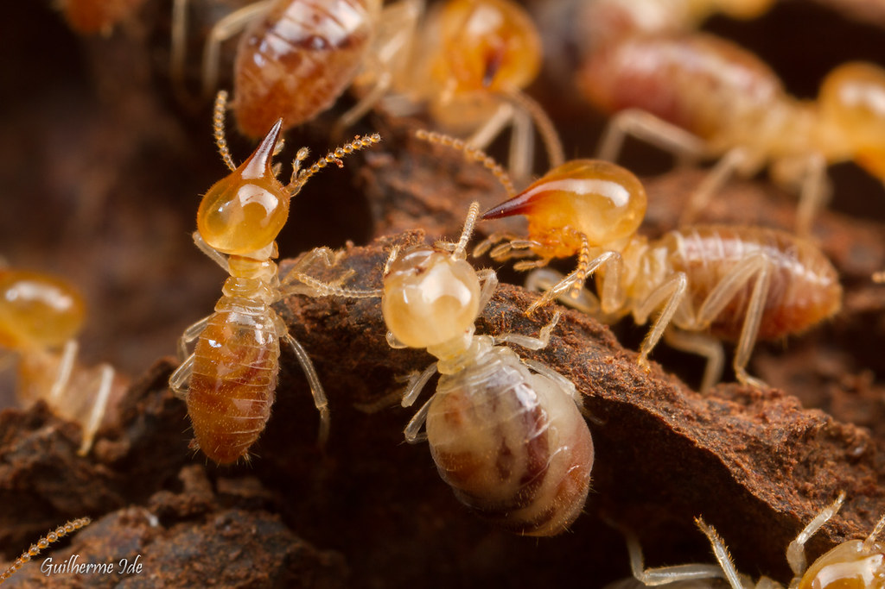

Segundo o *Painel Intergovernamental sobre Mudanças* Climáticas (IPCC, na sigla em inglês) o aquecimento global vem causando mudanças significativas nos ecossistemas, reduzindo a diversidade da fauna e da flora. Além disso, o aumento da temperatura média observada está relacionado com o crescimento das concentrações de gases de efeito estufa na atmosfera resultante de ações humanas. 

Adicionalmente, as projeções das mudanças climáticas preveem aumento da temperatura em 4oC até metade do século XXI e maior frequência de eventos climáticos extremos. Juntamente com o aumento da temperatura e o aumento do fluxo de carbono na atmosfera, essas mudanças afetarão diretamente o papel dos  seres responsáveis pela ciclagem de nutrientes, decomposição da biomassa vegetal e preservação dos solos. Seres conhecidos como OS MAIORES DECOMPOSITORES: os cupins.

Os cupins são os principais decompositores terrestres, e embora a decomposição da lignocelulose gere gases de efeito estufa*\*(CH4 e CO2)*, os cupins são capazes de retornar aproximadamente metade do carbono da *\*\*lignocelulose* para o solo. Esses insetos são considerados engenheiros ecossistêmicos pela sua capacidade de modificarem as propriedades físicas e químicas do solo, influenciando na disponibilidade de nutrientes para as plantas e alterando a estrutura da composição vegetal.

Nesse sentido, como estamos tratando de *\*\**animais ectotérmicos*, a temperatura do ambiente afeta a taxa de todos os processos bioquímicos e, portanto, é fundamental para determinar sua distribuição atual e futura sob as mudanças climáticas globais. Logo, a extinção desses bichinhos ocasionada pelas condições adversas de temperatura e umidade pode ocasionar problemas ambientais.

***E por último, fiquem com uma frase de um grande pesquisador da área para reflexão sobre a importância desses insetos no meio ambiente:***

*A grande maioria das espécies de cupins não é praga sob nenhuma circunstância, pelo contrário, desempenha atividades extremamente benéficas.*

*A conservação de populações de cupins está claramente ligada à fertilidade do solo e a uma agricultura sustentável de subsistência, principalmente em locais em que mudanças no uso do solo são crescentes, e em ambientes naturais cada vez mais perturbados e reduzidos.*

(Bignell, 2006)

**\
Glossário:**

\*\**CH4 e CO2: Gás Metano e Gás Carbônico, respectivamente.

\*\*Lignocelulose: Os materiais lignocelulósicos são aqueles que possuem lignina e celulose (e hemicelulose) em sua composição química. Suas principais fontes são os produtos primários e secundários da extração florestal (madeira em tora, colmos de bambu e etc).

\*\**Animais ectotérmicos: São animais de sangue frio, ou seja, dependem do comportamento e de fontes externas de calor (o sol) para controlar sua temperatura. No caso dos cupins dependem inclusive dos ninhos, os quais além de ajudar na proteção contra predadores também são capazes de regular condições ideais de temperatura e umidade para os indivíduos da colônia

*Recomendamos os seguintes textos, sites e mídias para saber mais:*

* Wikitermes: Projeto de divulgação científica sobre cupins <https://cupim.proec.ufabc.edu.br>
* Vídeo informativo: Ciência no cotidiano -  cupins <https://youtu.be/uNdBnHYoVGA>
* Trecho de reportagem: “Apocalipse dos insetos”: Nosso futuro na terra está em ris co <https://youtu.be/3iEG-wqewiI>
* Texto: [Como os cupins ajudam as florestas equatoriais a sobreviverem às mudanças climáticas | National Geographic (nationalgeographicbrasil.com)](https://www.nationalgeographicbrasil.com/meio-ambiente/2019/01/como-os-cupins-ajudam-as-florestas-equatoriais-a-sobreviverem-as-mudancas-climaticas)

Feito por:

Isabela da Costa Barreto 

***Referências de conteúdo:***

[Relatório de Síntese AR5: Alterações Climáticas 2014 — IPCC](https://www.ipcc.ch/report/ar5/syr/)

[Aquecimento no Sudeste foi causado por gases de efeito estufa | O TEMPO](https://www.otempo.com.br/interessa/aquecimento-no-sudeste-foi-causado-por-gases-de-efeito-estufa-1.2272980)

[Predição da dependência da temperatura da respiração microbiana no solo: uma análise em escala continental (wiley.com)](https://agupubs.onlinelibrary.wiley.com/doi/epdf/10.1029/2005GB002644)

[Quatro graus e além: o potencial para um aumento da temperatura global de quatro graus e suas implicações | Transações Filosóficas da Royal Society A: Ciências Matemáticas, Físicas e de Engenharia (royalsocietypublishing.org)](https://royalsocietypublishing.org/doi/10.1098/rsta.2010.0303)

[The fate of carbon utilized by the subterranean termite Reticulitermes flavipes (usda.gov)](https://srs.fs.usda.gov/pubs/ja/2021/ja_2021_trettin_008.pdf)

[Fibras Lignocelulósicas e Materiais Compósitos à Base de Biomassa - 1ª Edição (elsevier.com)](https://www.elsevier.com/books/lignocellulosic-fibre-and-biomass-based-composite-materials/jawaid/978-0-08-100959-8)

[Animais endotérmicos e ectotérmicos - Estudo Kids](https://www.estudokids.com.br/animais-endotermicos-e-ectotermicos/#:~:text=Os%20animais%20de%20sangue%20quente%20s%C3%A3o%20as%20aves,temperatura%20corporal%2C%20e%20%C3%A9%20chamado%20de%20mecanismos%20termorreguladores.)

***Referência da imagem:***

[Fotos - Wikitermes (ufabc.edu.br)](https://cupim.proec.ufabc.edu.br/fotos/)

<!--EndFragment-->