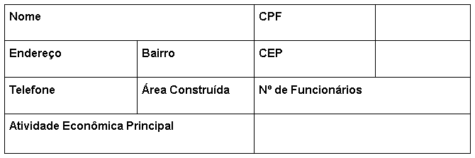

<!--StartFragment-->

Você já ouviu falar sobre o Plano de Gerenciamento de Resíduos Sólidos (PGRS)?

Primeiramente, um **Plano de Gerenciamento de Resíduos Sólidos** é um documento com validade de um ano, requerido pela lei brasileira de acordo com a diretriz de cada estado. Nele se identifica o tipo e a quantidade de resíduos sólidos gerados e quais as práticas ambientalmente corretas adotadas pelas empresas para a segregação, coleta, armazenamento, transporte, reciclagem, destinação e disposição final.

O PGRS é necessário para a renovação ou solicitação do licenciamento ambiental, ou seja, para que a autorização ambiental de funcionamento seja aceita. Órgãos de controle consideram a medida adequada dado que as empresas são forçadas a gerir melhor seus resíduos, reduzindo assim o impacto ambiental gerado por suas operações. Alguns dos ramos para os quais esse documento é obrigatório são os geradores de resíduos industriais; por exemplo a **indústria alimentícia**, **automobilística,** de **equipamentos eletrônicos**, as **serrarias**, **lavanderias**, entre outras; e da **construção civil**; como as empresas de construção, de **reformas**, **reparos e demolições** de obras dessa natureza, incluídos os resultantes da preparação e escavação de terrenos para obras civis.\
\
As leis federais em vigor para a elaboração do Plano de Gerenciamento de Resíduos Sólidos são: a Política Nacional de Resíduos Sólidos (PNRS) - Lei Federal nº 12.305/2010, sanções penais e administrativas derivadas de condutas e atividades lesivas ao meio ambiente - Lei Federal nº 9.605/1998, a Política Nacional de Educação Ambiental - Lei Federal nº 9.795/1999. 

Como mencionado acima, as leis ambientais estaduais seguem a diretriz de cada estado. Inserimos a seguir os exemplos de leis do estado de São Paulo: a Política Estadual de Resíduos Sólidos (PERS) - Lei Estadual nº 12.300/2006, a Política Estadual do Meio Ambiente - Lei Estadual nº 9.509/1997.

#### **A Seiva Jr. (Empresa Júnior de Consultoria e Sustentabilidade) produz esse documento para seus clientes desde agosto de 2021. Nossa equipe já desenvolveu o Plano de Gerenciamento de Resíduos Sólidos para diversos locais e clientes tanto em São Paulo e zona metropolitana - como Diadema, quanto em locais mais distantes e em parceria com outras Empresas Juniores do Brasil - como o documento produzido para um cliente de Ipirá na Bahia.** 

\
**Agora vamos entender um pouco mais como a SEIVA JR. estrutura o documento**.\
\
Para elaborar o PGRS é necessário identificar a **origem**, o **volume** e a **característica dos resíduos** para a *destinação* ambientalmente correta. Essa caracterização e classificação dos resíduos são baseadas nos laudos de análise química, segundo a NBR 10.004. Durante esse processo deve-se *classificar, quantificar, indicar formas* e *insumos* para a correta **identificação**, **manejo** e **segregação** na origem dos resíduos gerados por área ou setor da empresa. Além da avaliação da situação corrente da gestão de resíduos do empreendimento. Todos esses pontos são identificados através de uma ***visita técnica*** feita pela nossa equipe ou por equipes parceiras locais.

\
O Plano de Gerenciamento de Resíduos Sólidos é constituído por diferentes etapas. A seguir descreveremos como a Seiva Jr. explora cada parte deste documento: 

#### 1° A importância do PGRS

Descrever o principal objetivo do Plano de Gerenciamento de Resíduos Sólidos - **gerenciamento ambiental correto**. Apresentação das leis nacionais e estaduais que definem o conjunto de informações e estratégias integradas de gestão, destinadas a normatizar os procedimentos operacionais de gerenciamento de resíduos sólidos. Medidas que *minimizem, controlem e reduzam* o impacto e riscos ambientais condicionados pela geração de resíduos. Ações que devem ser tomadas pela empresa para que o documento seja eficaz.

#### 2° Dados do empreendedor e do local do empreendimento

Nesse momento contamos com o preenchimento das informações na tabela acima, assim como desenvolvemos um mapa através do QGIS e descrevendo a área total (tamanho, local, CEP, proximidade a capitais, tipo de região e suas características populacionais), a área construída, o tipo de infraestrutura. Além de informar o *horário de funcionamento da empresa, sua planta baixa atual e possíveis reformas e ampliações*.

Confira um modelo de mapa abaixo (arquivo próprio):

#### 3° Fluxograma do processo produtivo

Desenvolver um ou mais fluxogramas que descrevem os **processos produtivos** e **geradores de resíduos** do empreendimento, o objetivo dessa etapa do PGRS é simplificar a análise da geração dos resíduos sólidos. 

#### 4° Conceitos e leis

Apresentar os conceitos utilizados no documento para compreensão de todos que o leiam, independente de terem conhecimento ou não do assunto. Descrever brevemente as leis e normas aplicáveis à elaboração do PGRS.  

#### 5° Resíduos: classificação, coleta seletiva e 4R’s, separação, coleta\
Explicar e exemplificar o sistema de classificação de resíduos sólidos segundo a norma técnica ABNT/NBR 10.004/04, deixando clara a diferença entre os resíduos Classe I, Classe II, Classe II A e Classe II B. 

Apresentar o que é a coleta seletiva e qual a separação e descarte corretos a partir do código de cores estabelecido pela Resolução **CONAMA n° 275/2001**, além de explicar a ***ordem de prioridade*** da gestão e gerenciamento de resíduos com base nos 4R’s - ***Repensar, Reduzir, Reciclar e Reutilizar***; gerando assim atitudes mais sustentáveis e mudando o comportamento dentro das empresas. 

Descrever como deve ocorrer a separação dos resíduos sólidos gerados a partir de um diagnóstico de acordo com a sua **tipologia**, seja ela a região geradora, área ou setor do empreendimento. Essa etapa do PGRS é ***única para cada empreendimento***, pois são descritos todos resíduos sólidos gerados, como o resíduo foi gerado, suas classificações, como e para onde deve ser destinado - passando por todo processo de *manejo, acondicionamento, armazenamento e destinação*. 

Para auxiliar o empreendedor a fazer a destinação correta dos resíduos sólidos gerados na sua empresa, aqui é descrito o *nome, endereço, email e telefone de postos de coleta seletiva e empresas* que realizam a coleta de resíduos especiais, caso necessário. 

#### 6° Gerenciamento em caso de acidentes

Orientação para **minimizar** os riscos gerados durante o processo de *manejo, transporte e armazenamento* dos resíduos sólidos para os funcionários da empresa. Mantendo assim o **compromisso socioambiental** e com a **saúde pública**.

#### 7° Metas de educação ambiental

Apresentar um plano de **metas progressivas** e de **educação ambiental**, tanto para os funcionários da empresa quanto para mudanças dentro do próprio empreendimento, que possibilitem que o PGRS alcance a máxima eficiência durante os ***12 meses*** de validade do documento.

#### 8° Referências

Seguem melhor descritas as normas, leis e resoluções que são aplicáveis à produção do Plano de Gerenciamento de Resíduos Sólidos, por exemplo:

ABNT. **Amostragem de Resíduos Sólidos. NBR 10.007/2004**. Rio de Janeiro: ABNT, 2004.

ABNT. **Classificação dos Resíduos Sólidos. NBR 10.004/2004**. Rio de Janeiro: ABNT, 2004.

BRASIL. Lei Nº 12.305, de 2 de agosto de 2010. **Institui a Política Nacional de Resíduos Sólidos**; altera a Lei no 9.605, de 12 de fevereiro de 1998; e dá outras providências. Brasília: Casa Civil, 2010.

CONAMA. **Resolução CONAMA Nº 275, de 25 de abril de 2001**. Brasília: MMA, 2001. 

#### 9° Anexos

Anexação de tabelas com todos resíduos sólidos produzidos melhor descritos para **facilitação da pesquisa e leitura**. Assim como de outros documentos necessários, como a Anotação de Responsabilidade Técnica (ART).

#### **Agora que você já entendeu como funciona um PGRS, qual a importância dele e por que é necessário e obrigatório. Procure saber se a validade desse documento para o seu empreendimento está em dia ou se o seu novo negócio precisará da autorização de licenciamento ambiental. E entre em contato com a Seiva Jr. para pedir um orçamento!! Estamos à disposição para atendê-lo e solucionar as suas dificuldades/necessidades.**  

Feito por:

Ivete Batista

Mariane Becherer

<!--EndFragment-->