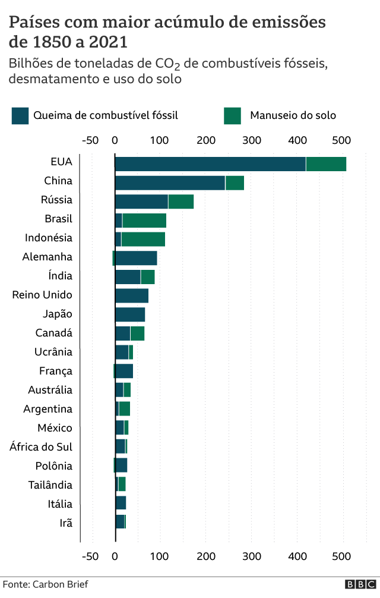
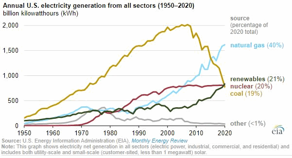
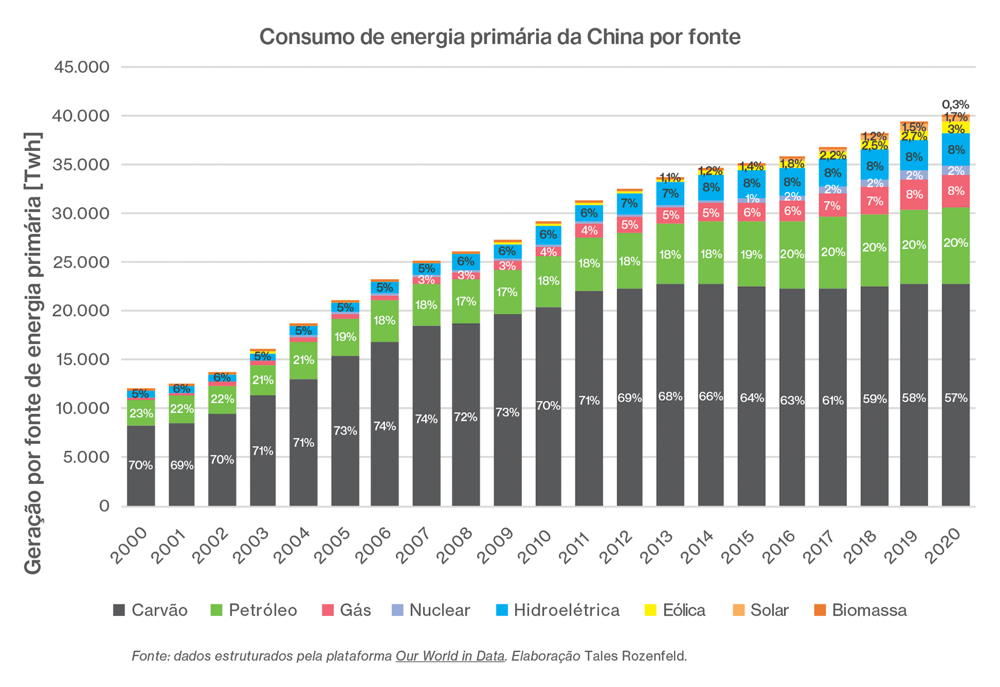
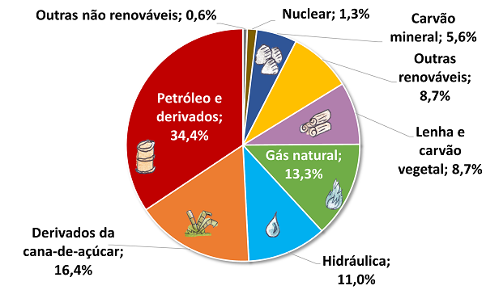
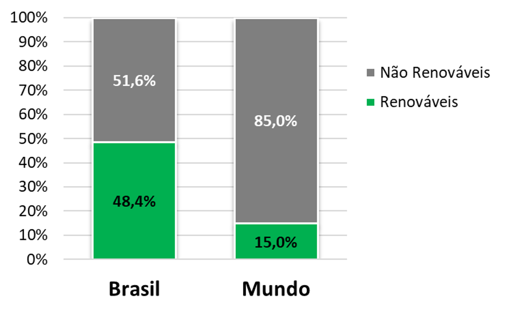

Segundo o Painel Intergovernamental sobre Mudança do Clima (IPCC) é incontestável o efeito das atividades humanas no clima do planeta. Desde a Revolução Industrial, a emissão de gases de efeito estufa aumentou exponencialmente, afetando de forma perceptível as mais diversas regiões do planeta. Conseguimos sentir as mudanças climáticas em nosso cotidiano: chuvas intensas, furacões fora da época esperada e o derretimento das geleiras são apenas alguns exemplos disso. A queima de combustíveis fósseis como carvão e petróleo são as principais atividades responsáveis pela emissão de gases de efeito estufa. Nesse sentido, pode-se dizer que, atualmente, a produção de energia ainda é muito poluente. Portanto, para combater esse problema, diversas alternativas vêm sendo propostas. Dentre elas, podemos destacar a **_transição energética._**

A transição energética diz respeito a uma mudança de perspectiva na produção, consumo e reaproveitamento da energia. Com o intuito de diminuir a emissão de gases de efeito estufa, a transição energética propõe a substituição do carvão e petróleo por fontes de energia renováveis, como a hidrelétrica, a eólica e a solar, as quais emitem menos gases de efeito estufa, retirando a carga de uso dos recursos naturais do planeta, e tem a vantagem de ser renovável, característica que as fontes fósseis não possuem. Pode-se observar os esforços da transição energética nos acordos firmados nos últimos anos acerca das mudanças climáticas, Protocolo de Kyoto e Acordo de Paris por exemplo, ou nos eventos onde se discutem os efeitos das mudanças climáticas e possíveis soluções, como a Conferência das Partes (COP) que acontece anualmente.

Podemos ter um panorama do andamento da transição energética no mundo analisando as matrizes energéticas de vários países. Analisaremos as matrizes dos dois países que mais emitem gases de efeito estufa, Estados Unidos e China e do Brasil:

**_Estados Unidos_**

Podemos ver que a maior parte da produção de energia americana vem de fontes não renováveis, gás natural (40%) e carvão (19%). Enquanto o uso de gás natural aumentou no período analisado, o uso de carvão diminuiu. No entanto, também é perceptível que o uso de energias renováveis, ainda que pequeno, já está maior que o uso de carvão.

**_China_**

Diferentemente dos EUA, a fonte primária de energia da China é o carvão, altamente poluente. Também percebemos que desde 2012 o uso de fontes fósseis permaneceu praticamente constante, enquanto o uso de fontes renováveis teve um leve aumento, sendo em 2020 responsável por 13% da geração de energia chinesa.

**_Brasil_**

Podemos ver que, diferentemente dos outros países analisados, as fontes renováveis são muito mais utilizadas no Brasil, compondo cerca de 48,4% da matriz energética do país, enquanto o uso de fontes não renováveis chega a 51,6%.

Diante disso, pode-se perceber que ainda há muito o que avançar na substituição de fontes de energias não renováveis por renováveis, uma vez que a maior parte dos países ainda usam combustíveis fósseis como fonte primária de energia. Nesse sentido, entende-se que a transição energética é uma alternativa a problemática ambiental que deve ser incentivada e buscada cada vez mais.

\
_Feito por:_

Gustavo Teodoro Bauke

**_Referências de conteúdo:_**

<https://www.gov.br/mcti/pt-br/acompanhe-o-mcti/sirene/publicacoes/relatorios-do-ipcc/arquivos/pdf/IPCC_mudanca2.pdf>

<https://www.gov.br/mcti/pt-br/acompanhe-o-mcti/cgcl/paginas/painel-intergovernamental-sobre-mudanca-do-clima-ipcc>

<https://www.enelgreenpower.com/pt/learning-hub/transicao-energetica>

<https://www.epe.gov.br/pt/abcdenergia/matriz-energetica-e-eletrica>

<https://porque.com.br/matriz-energetica-chinesa-uma-breve-analise-grafico>

<https://ensaioenergetico.com.br/a-lideranca-chinesa-na-transicao-energetica-global/>

<https://www.frontliner.com.br/participacao-do-carvao-na-matriz-energetica-dos-eua-cresceu-15-em-2021/#:~:text=Os%20EUA%20obt%C3%AAm%20mais%20de,do%20carv%C3%A3o%20subiu%20para%2023%25>

<https://www.bbc.com/portuguese/geral-59013520>
